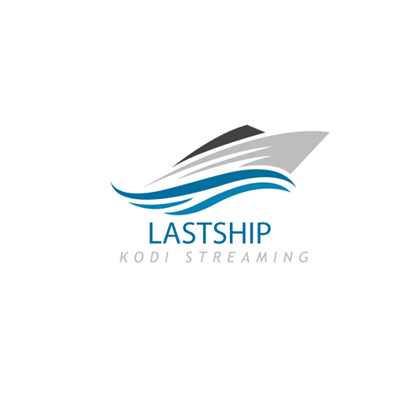

## Willkommen bei Lastship für Kodi!

Bei Lastship handelt es sich um ein Video-Addon für Kodi, welches das Streamen von Filmen und Serien über optisch ansprechende Benutzeroberfläche ermöglicht

Webseiten werden auch als Indexseiten bezeichnet, welche auf die eigentlichen Quellen verweisen, die für das bereitgestellte Angebot verantworlich sind! 

Lastship dient nur als Suchmaschine und hostet selbst kein Daten!

Da das Addon nicht weiter entwickelt wird, ist der Funktionsumfang von Lastship eingeschränkt.

Einige Funktionen sind daher defekt, auch mache Indexseiten funktionieren leider nicht mehr.....

Um dem Projekt wieder leben einzuhauchen, werden Python Entwickler, die am Projekt mitwirken wollen, gesucht.

KODI - Video Addon for Lastship.

* [Download the Official Version](https://bit.ly/3n2T7Od)

or

* [Download the Ctrl_Esc_REPO Version 4.0.6.4 unofficial](https://bit.ly/2Dv27th)

* [Download the Ctrl_Esc_REPO Version 4.0.6.5 unofficial](https://bit.ly/3igxgiw)

* [Download the Ctrl_Esc_REPO Version 4.0.7.1.1 unofficial](https://bit.ly/30i4qIB)

Meldet Euch doch bitte im Chat!°

https://gitter.im/Lastship_Chat/Lobby
