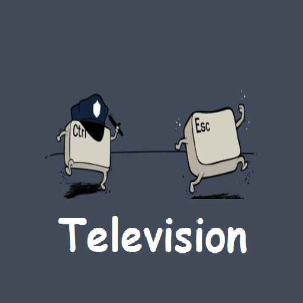

*** Ctrl_Esc Television ***

ist ein spontanes Projekt, für KODI Leia USER,
welches mehrere "Möglichkeiten" miteinander vereinen soll!°

... die wiedergabe von "untereinander bis mitereinander"!°...

- plugin://script.module.****
- plugin://plugin.video.****
 
oder Listen mit 
- http://****

- .ts 
- .m3u
- .m3u8
- .mp4
- .pvr

etc... 

--------------------------------------------------------------------------------------------

In der Datei: ""videos.json"", kann somit obiger Inhalt
von ""DIR"", in der videos.json, hinzu- / eingefügt werden!  °!°

Siehe daher doch einmal in die "video.json" Datei 
und trage "Deinen" eigenen Inhalt hinzu 
und teile

 ""DEINE videos.json"" Datei
 
mit "DEINEN Freunden" und / "DEINER Community"!!!

denn:

***°°!Sharing Is Caring!°°***

--------------------------------------------------------------------------------------------

Um etwaige Fehlermeldungen bei der Installation der "erforderlichen Script Module" zu vermeiden,
ist es erforderlich,
falls noch nicht geschehen,

***""VORHER""***

Folgende Abhängigkeiten "Dependencies",

in "genau" dieser Reihenfolge zu installieren:

- script.module.six				1.15.0		https://bit.ly/3oH7dqr
- script.module.urllib3			1.26.9		https://bit.ly/3Q9H53a
- script.module.idn				2.8.0		https://bit.ly/3PQdP1E
- script.module.chardet			4.0.0		https://bit.ly/3SewvtG
- script.module.certifi			2021.10.8	https://bit.ly/3zL0oKK
- script.module.pyamf			0.6.2		https://bit.ly/3Bxu2Vq
- script.module.dateutil		2.8.1		https://bit.ly/3BpDcDg
- script.module.future			0.17.1		https://bit.ly/3BAiLDP
- script.module.routing			0.2.3		https://bit.ly/3bk1XWM
- script.module.pycryptodome	3.4.1		https://bit.ly/3cUMxZA
- script.module.requests		2.27.1		https://bit.ly/3zhZioB
- script.module.requests-cache	0.4.13		https://bit.ly/3bjmRVX

OPTIONAL:

- script.module.urlresolver		2021.12.23	https://bit.ly/3zMKWxG

--------------------------------------------------------------------------------------------
...ERST DANN "die erforderlichen Module":

- script.module.ctrl (optional)
- script.module.esc (optional)
- script.module.v-service (optional)

installieren!!!

... und ERST DANN "das Addon":

- plugin.video.ctrl_esc_tv

installieren!!!

--------------------------------------------------------------------------------------------

Optional, oder weitere "Script Module"

.....----sind HIER nicht enthalten!!!----.....

--------------------------------------------------------------------------------------------

***°!This Addon is for etucation and personal usage, only!°***

--------------------------------------------------------------------------------------------

Control_Escape
and
The Dependencie Brothers From Another Mothers

--------------------------------------------------------------------------------------------
Have Fun
--------------------------------------------------------------------------------------------

* [Download the Ctrl_Esc_REPO Version - 4.8.1](https://bit.ly/3dHqq9c)

